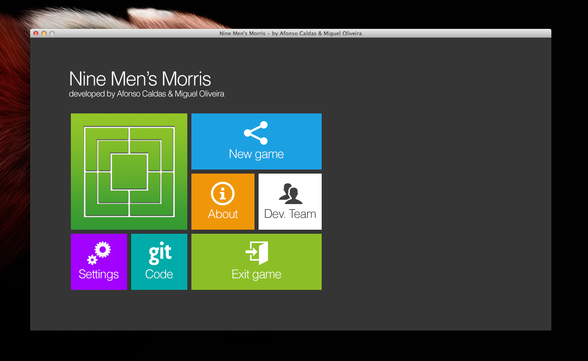
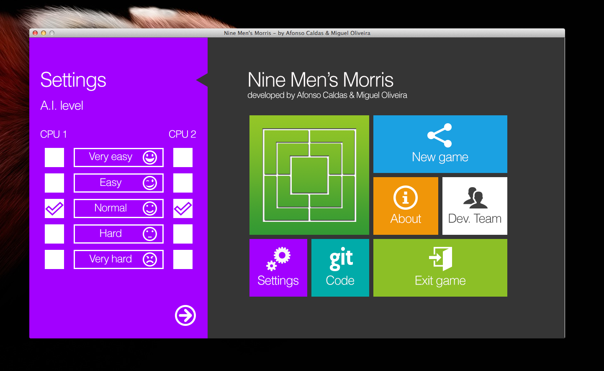
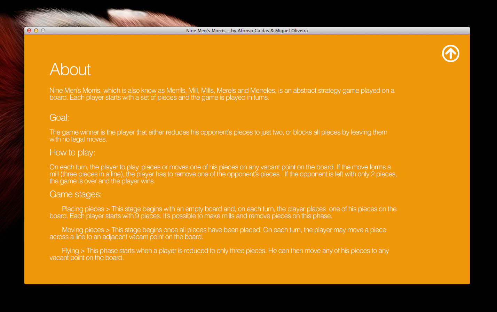
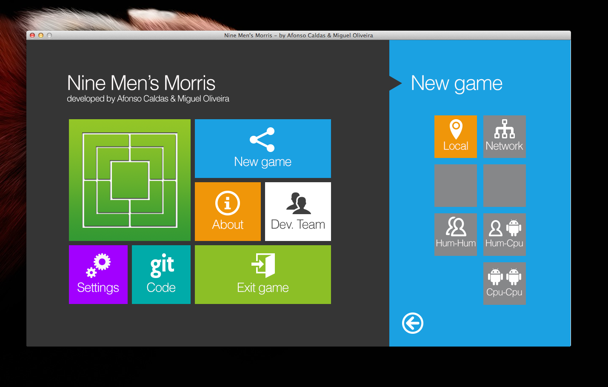
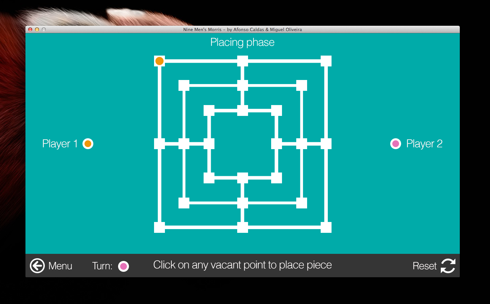

Nine Men's Morris Game
======================

The board game implemented in Java with a Swing GUI.

The AI uses the Minimax algorithm with Alpha-Beta pruning to chose the best moves.

Allows multiplayer games across local networks using the Kryonet library.

## Screenshots

